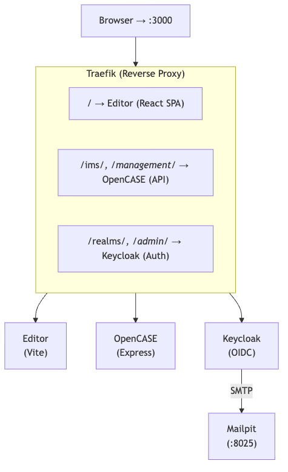

# OpenCASE

Every education system organises what students should learn into structured documents — curriculum standards, competency frameworks, learning outcomes. These documents define the building blocks of education: what gets taught, how progress is measured, and how qualifications relate to each other.

**[CASE](https://www.1edtech.org/activity/case)** (Competencies & Academic Standards Exchange) is the open standard that makes these frameworks machine-readable and interoperable. Instead of PDFs and spreadsheets that lock information in silos, CASE lets systems share, align, and build on each other's standards.

**OpenCASE** is a complete, open-source platform for creating, managing, and publishing CASE frameworks.

---

## What OpenCASE provides

| | |
|---|---|
| **Visual Editor** | Build competency frameworks on an interactive canvas. Drag, connect, and organise items visually — no spreadsheets or hand-edited files required. |
| **Publishing Server** | Publish frameworks through a standards-compliant API so that learning platforms, assessment tools, and credential systems can discover and consume them automatically. |
| **Identity and Access** | Multi-tenant security so that different organisations can each manage their own frameworks independently, with role-based access controls for viewers, authors, and administrators. |

## Key capabilities

- **Standards-compliant** — fully supports CASE 1.0 and CASE 1.1 specifications, ready for 1EdTech certification
- **Multi-tenant** — each organisation operates in its own isolated workspace with separate users and data
- **Version-controlled** — every change to a framework is preserved as an immutable version with full history
- **Single-command deployment** — the entire stack launches from one command, with automatic HTTPS when deployed to a server
- **Extensible** — designed so that storage, identity providers, and transport layers can be swapped without changing the core platform
- **Open source** — transparent, forkable, and free to use under the Apache 2.0 licence

## How it works

The platform runs as a set of coordinated services behind a single entry point. The visual editor connects to the publishing server, which stores and serves frameworks. A dedicated identity service handles sign-in, access controls, and tenant isolation. All traffic is routed through a reverse proxy that provides a unified address and, in production, automatic TLS certificates.

## Getting started

To deploy OpenCASE on a server with automatic HTTPS, follow the [Deployment Guide](docs/GET_STARTED.md).

To set up a local development environment, see the [Development Guide](docs/DEVELOPMENT.md).

## Further reading

| Guide | Description |
|-------|-------------|
| [Deployment Guide](docs/GET_STARTED.md) | Deploy on a Linux server with Docker and automatic HTTPS |
| [Development Guide](docs/DEVELOPMENT.md) | Local setup, commands, services, and project structure |
| [Auth0 SSO Guide](docs/AUTH0_SSO.md) | Configure Auth0 as an external identity provider |
| [Editor Overview](apps/editor/README.md) | The visual framework editor |
| [Publishing Server Overview](apps/opencase/README.md) | The CASE-compliant publishing server |
| [API Reference](apps/opencase/FRAMEWORK_MANAGEMENT_GUIDE.md) | Endpoint reference for integrators |
| [Licensing](apps/opencase/docs/Licensing.md) | Framework licensing and access rights |
