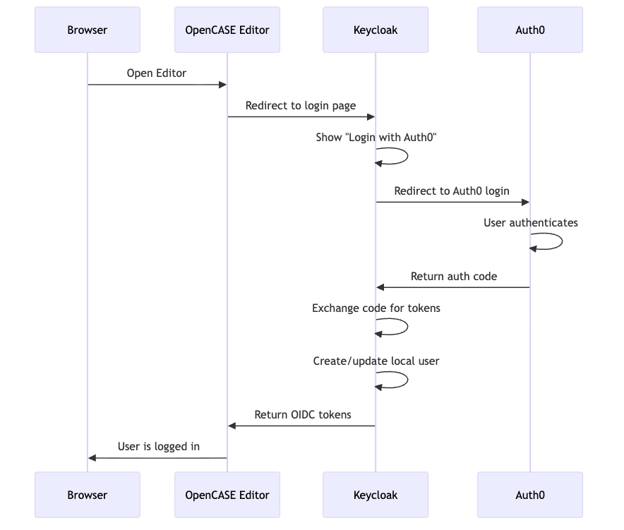
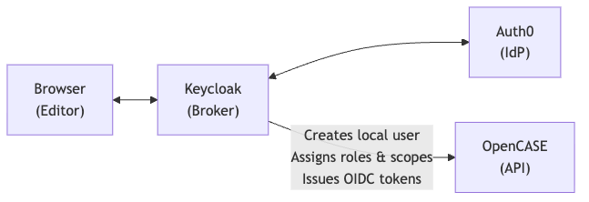

# Auth0 SSO with Keycloak

Configure Auth0 as an external Identity Provider (IdP) so users can log in to OpenCASE using their Auth0 accounts. Keycloak acts as the broker -- it delegates authentication to Auth0 and creates local user accounts automatically on first login (Just-in-Time provisioning).

## How It Works



---

## Prerequisites

- OpenCASE is running (see [Get Started Guide](GET_STARTED.md))
- You have an **Auth0 account** (free tier works)
- You know your **OpenCASE domain** (e.g. `opencase.1edtech.org`)

---

## Step 1 -- Create an Application in Auth0

1. Log in to the [Auth0 Dashboard](https://manage.auth0.com/)
2. Go to **Applications** > **Applications** > **Create Application**
3. Enter a name, e.g. `OpenCASE SSO`
4. Select **Regular Web Applications**
5. Click **Create**

### Configure Application Settings

In the application's **Settings** tab, scroll to **Application URIs** and set:

| Field | Value |
|-------|-------|
| **Allowed Callback URLs** | `https://YOUR_DOMAIN/realms/opencase/broker/auth0/endpoint` |
| **Allowed Logout URLs** | `https://YOUR_DOMAIN`, `https://YOUR_DOMAIN/realms/opencase/broker/auth0/endpoint/logout_response` |
| **Allowed Web Origins** | `https://YOUR_DOMAIN` |

Replace `YOUR_DOMAIN` with your OpenCASE hostname (e.g. `opencase.1edtech.org`).

> The second logout URL is Keycloak's own broker callback, not the OpenCASE app itself. Keycloak's front-channel logout (see [Logout Settings](#logout-settings) below) redirects the browser to Auth0, and Auth0 needs to redirect it back to this exact Keycloak URL before Keycloak can finish logging the user out and return them to OpenCASE. Without it, Auth0 will reject the return redirect after processing the logout.

> The callback URL follows Keycloak's broker pattern: `/realms/{realm}/broker/{alias}/endpoint`. We'll use `auth0` as the alias in Step 2.

### Note Your Credentials

From the **Settings** tab, copy these values -- you'll need them in Step 2:

- **Domain** (e.g. `your-tenant.auth0.com`)
- **Client ID**
- **Client Secret**

### Scroll down and click **Save Changes**

---

## Step 2 -- Add Auth0 as an Identity Provider in Keycloak

### Open the Keycloak Admin Console

Navigate to `https://YOUR_DOMAIN/admin/` and log in with your Keycloak admin credentials (the `ADMIN_PASSWORD` from your `.env` file, username `admin`).

### Select the OpenCASE Realm

Make sure you're in the **opencase** realm (top-left dropdown). If you see "master", switch to "opencase".

### Add a New Identity Provider

1. In the left sidebar, click **Identity providers**
2. Click **Add provider** > **OpenID Connect v1.0**

### Configure the Provider

Fill in the following fields:

| Field | Value |
|-------|-------|
| **Alias** | `auth0` |
| **Display name** | `Auth0` (or your preferred label, e.g. `Login with Auth0`) |
| **Discovery endpoint** | `https://YOUR_AUTH0_DOMAIN/.well-known/openid-configuration` |
| **Client ID** | (from Step 1) |
| **Client Secret** | (from Step 1) |

Replace `YOUR_AUTH0_DOMAIN` with your Auth0 domain (e.g. `your-tenant.auth0.com`).

After entering the discovery endpoint, click outside the field -- Keycloak will auto-populate the authorization, token, and userinfo endpoints.

### Additional Settings

| Field | Value |
|-------|-------|
| **Client Authentication** | `Client secret sent as post` |
| **Default Scopes** | `openid email profile` |
| **Trust Email** | `On` |
| **Sync Mode** | `Force` (updates user attributes on every login) |

> **Trust Email = On** means Keycloak trusts that Auth0 has already verified the user's email. Without this, users may be prompted to verify their email again.

> **Sync Mode = Force** ensures user profile data (name, email) stays in sync with Auth0 on each login. Use `Import` if you only want to import on first login.

### Logout Settings

By default, logging out of OpenCASE only ends the Keycloak session -- the Auth0 session stays active. If left this way, a user who logs out and then logs back in will be silently re-authenticated by Auth0 (skipping the credentials/password step entirely), because their Auth0 SSO cookie is still valid. To propagate logouts to Auth0:

1. Scroll to **Advanced settings** (or **OpenID Connect settings**)
2. Set **Logout URL** to `https://YOUR_AUTH0_DOMAIN/oidc/logout` (may already be populated from the discovery endpoint)
3. Enable **Store Tokens** (on the main provider settings page) -- this lets Keycloak attach the user's Auth0-issued ID token as `id_token_hint` when it logs them out of Auth0, so Auth0 can identify the exact session and end it silently instead of prompting for confirmation
4. Leave **Backchannel logout** **disabled**

> **Do not enable Backchannel Logout here.** Despite the name, this setting makes Keycloak call Auth0's logout endpoint as a server-to-server backend request, not through the user's browser. Auth0 will report the call as successful, but it has no way to clear a cookie in a browser it never talked to -- the user's Auth0 session survives. Only the front-channel (browser-redirect) logout that happens when this is left disabled can actually clear the Auth0 SSO cookie.

Also ensure your Auth0 application has the correct **Allowed Logout URLs**, including the Keycloak broker callback (see [Step 1](#configure-application-settings)).

### Click **Save**

---

## Step 3 -- Configure Claim Mappers

Keycloak needs to map Auth0's token claims to local user attributes. Without these, the username will be set to Auth0's raw user ID (e.g. `auth0|abc123`) which contains invalid characters.

1. In the Auth0 identity provider settings, click the **Mappers** tab
2. Click **Add mapper** for each of the following:

### Username Mapper (Important)

Auth0's `sub` claim looks like `auth0|665065950e64e810e52d03ea`, which Keycloak rejects because the `|` character is invalid in usernames. This mapper uses the email address as the username instead.

| Field | Value |
|-------|-------|
| **Name** | `username` |
| **Mapper type** | `Username Template Importer` |
| **Template** | `${CLAIM.email}` |

### Email Mapper

| Field | Value |
|-------|-------|
| **Name** | `email` |
| **Mapper type** | `Attribute Importer` |
| **Claim** | `email` |
| **User Attribute Name** | `email` |

### First Name Mapper

| Field | Value |
|-------|-------|
| **Name** | `first-name` |
| **Mapper type** | `Attribute Importer` |
| **Claim** | `given_name` |
| **User Attribute Name** | `firstName` |

### Last Name Mapper

| Field | Value |
|-------|-------|
| **Name** | `last-name` |
| **Mapper type** | `Attribute Importer` |
| **Claim** | `family_name` |
| **User Attribute Name** | `lastName` |

Click **Save** after each mapper.

---

## Step 4 -- Expose Identity Provider in the Token

By default Keycloak does not include which identity provider a user authenticated through in the tokens it issues. OpenCASE uses this information to hide the **Change Password** option for federated users — users whose password is managed by Auth0 rather than Keycloak cannot change it through Keycloak, so the menu item is suppressed when this claim is present.

This requires two things: a mapper on the Auth0 IdP that writes the IdP alias as a permanent user attribute, and a protocol mapper on the `profile` client scope that emits that attribute as a token claim.

### Part A — Hardcoded Attribute mapper on the Auth0 IdP

This writes `identity_provider = auth0` onto the Keycloak user record the first time they log in via Auth0. Storing it as a user attribute (rather than a session note) means it survives session expiry and token refreshes.

1. In the Keycloak Admin Console, go to **Identity Providers** → **auth0** → **Mappers** tab
2. Click **Add mapper**
3. Fill in the following fields:

| Field | Value |
|---|---|
| **Name** | `identity-provider` |
| **Sync Mode Override** | `Inherit` |
| **Mapper type** | `Hardcoded Attribute` |
| **User Attribute** | `identity_provider` |
| **Attribute Value** | `auth0` |

4. Click **Save**

> **Existing users:** Auth0 users who logged in before this mapper was added will not have the attribute on their record yet. They will need to log out and log back in once for it to be written.

### Part B — User Attribute protocol mapper on the `profile` client scope

This emits the `identity_provider` user attribute as a claim in the ID token. Adding it to the realm-level `profile` scope means it applies to every tenant client automatically.

1. In the Keycloak Admin Console, go to **Client scopes** (realm-level, left sidebar) → `profile` → **Mappers** tab
2. Click **Add mapper** → **By configuration** → **User Attribute**
3. Fill in the following fields:

| Field | Value |
|---|---|
| **Name** | `identity-provider` |
| **User Attribute** | `identity_provider` |
| **Token Claim Name** | `identity_provider` |
| **Claim JSON Type** | `String` |
| **Add to ID token** | On |
| **Add to access token** | Off |
| **Add to userinfo** | Off |

4. Click **Save**

After these changes, federated users will have `"identity_provider": "auth0"` in their ID token. OpenCASE reads this claim to determine whether to offer the Change Password menu item — native Keycloak users have no such attribute and will continue to see the option as before.

---

## Step 5 -- Configure First Login Flow (Optional)

When a user logs in via Auth0 for the first time, Keycloak's **First Broker Login** flow determines what happens. The default flow:

1. Reviews the user's profile
2. Creates a local Keycloak account
3. Links it to the Auth0 identity

This works well for most setups. If you want to **skip the review page** and create users silently:

1. Go to **Authentication** in the left sidebar
2. Find **first broker login** flow
3. Click the settings icon on **Review Profile** and set it to **Disabled**

---

## Step 6 -- Test the Integration

1. Open your OpenCASE Editor: `https://YOUR_DOMAIN`
2. Click **Sign in**
3. On the Keycloak login page, you should see an **Auth0** button (or whatever display name you set)
4. Click it -- you'll be redirected to Auth0's login page
5. Authenticate with your Auth0 credentials
6. You'll be redirected back to OpenCASE, now logged in

> **First login:** Keycloak may show a profile review page asking you to confirm your email and name. After this, subsequent logins go straight through.

---

## Step 7 -- Assign Roles to SSO Users

Users who log in via Auth0 are created in Keycloak with no roles by default. To give them access to OpenCASE features, you need to assign roles:

### Manual Role Assignment

1. In the Keycloak Admin Console, go to **Users**
2. Find the Auth0 user (they appear after their first login)
3. Click on the user > **Role mappings** tab
4. Assign the appropriate client roles for their tenant (e.g. `case.read`, `case.write`, `case.owner`)

### Automatic Role Assignment (Optional)

To assign a default role to all Auth0 users automatically:

1. Go to **Identity providers** > **auth0** > **Mappers** tab
2. Click **Add mapper**
3. Configure:

| Field | Value |
|-------|-------|
| **Name** | `default-role` |
| **Mapper type** | `Hardcoded Role` |
| **Role** | (select the role to assign) |

---

## Troubleshooting

### "Invalid redirect_uri" error on Auth0

The callback URL in Auth0 doesn't match what Keycloak sends. Verify the **Allowed Callback URLs** in Auth0 matches exactly:

```
https://YOUR_DOMAIN/realms/opencase/broker/auth0/endpoint
```

Check for trailing slashes, http vs https, and port numbers.

### "Invalid token issuer" error in Keycloak

The discovery endpoint URL is wrong. It should be:

```
https://YOUR_AUTH0_DOMAIN/.well-known/openid-configuration
```

### User is created but has no email

Auth0 might not be returning the `email` claim. In Auth0:

1. Go to **Actions** > **Flows** > **Login**
2. Add a custom action that ensures the email claim is in the ID token:

```javascript
exports.onExecutePostLogin = async (event, api) => {
  if (event.user.email) {
    api.idToken.setCustomClaim('email', event.user.email);
  }
};
```

Or verify that the **Default Scopes** in Keycloak's Auth0 IdP config include `email`.

### Username contains "auth0|..." and is rejected

Auth0's `sub` claim contains a `|` character that Keycloak doesn't allow in usernames. Add a **Username Template Importer** mapper (see Step 3) that uses `${CLAIM.email}` as the template.

### Users are prompted to verify email

Set **Trust Email** to **On** in the Auth0 identity provider settings in Keycloak (Step 2).

### Auth0 button doesn't appear on login page

Make sure the Auth0 identity provider is **Enabled** (toggle at the top of the IdP settings page in Keycloak).

### Logging out and back in skips the password prompt

If a user logs out of OpenCASE and immediately logging back in with the same account goes straight to the home page without ever showing Auth0's login form, the Auth0 SSO cookie in their browser is still valid -- see [Logout Settings](#logout-settings). This almost always means **Backchannel Logout** is enabled on the Auth0 IdP; disable it and confirm **Store Tokens** is enabled instead. Also double-check the Keycloak broker callback URL is present in Auth0's **Allowed Logout URLs** (see [Step 1](#configure-application-settings)) -- without it, Auth0 will reject the redirect back to Keycloak after processing the logout.

---

## Making Auth0 the Default Login (Optional)

If you want users to go directly to Auth0 without seeing the Keycloak login page:

1. Go to **Authentication** > **Browser** flow
2. Click the settings icon on **Identity Provider Redirector**
3. Set **Default Identity Provider** to `auth0`

Now when users click "Sign in", they'll be sent directly to Auth0. To still allow direct Keycloak login (e.g. for admin), append `?kc_idp_hint=` (empty) to the login URL.

---

## Making Auth0 the Only Login Option

The default-IdP redirect above still leaves the Keycloak username/password form reachable (e.g. via `?kc_idp_hint=`). To remove native Keycloak login entirely -- so Auth0 is the only way in -- you need to strip the login form out of the realm's browser authentication flow, not just set a default IdP.

> **This locks out any native Keycloak user accounts in this realm** -- there is no local login path left once the form is disabled. Migrate or federate any KC-native admin/service accounts through Auth0 first. This only affects the realm you edit (e.g. `opencase`, or a given `tenant-{id}` realm) -- other realms, including `master`, are untouched, so Keycloak admin console access is unaffected.

1. **Authentication** → **Flows** → select the **Browser** flow → **Duplicate** it (e.g. name it `Browser - Auth0 Only`). Don't edit the built-in flow directly.
2. In the duplicated flow, set requirements:
   - **Cookie** → `Alternative`
   - **Identity Provider Redirector** → `Alternative` -- click its gear/settings and set **Default Identity Provider** to `auth0`
   - **Forms** (the sub-flow containing Username Password Form) → `Disabled`
3. Disabling **Forms** removes the username/password form entirely, so there's nothing left to fall back to except the Auth0 redirect -- `kc_idp_hint=` tricks no longer work either.
4. Bind the new flow as the realm's browser flow. In Keycloak 26, this is done from inside the flow rather than a separate Bindings tab:
   - Open `Browser - Auth0 Only`
   - Click the **Action** dropdown (top-right, near "Add step"/"Add sub-flow") → **Bind flow**
   - Choose **Browser flow** as the usage, then **Save**
   - Back on the **Flows** list, confirm `Browser - Auth0 Only` now shows the **Browser flow** tag and the old built-in `browser` flow no longer does
5. Test in an incognito window: hitting the OpenCASE login should redirect straight to Auth0 with no Keycloak form ever rendered.

If you have multiple tenant realms (`tenant-{id}`), repeat this per realm that should be Auth0-only.

---

## Architecture with Auth0



Keycloak remains the OIDC provider for OpenCASE. Auth0 is an upstream identity source. This means:

- OpenCASE only talks to Keycloak (no Auth0 dependency in code)
- Roles and scopes are managed in Keycloak
- You can add more IdPs later (Google, Azure AD, SAML, etc.) without changing OpenCASE
- User accounts are local to Keycloak, linked to their Auth0 identity
