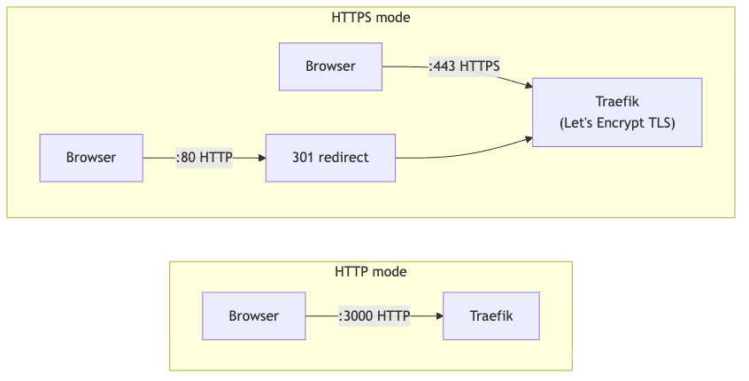
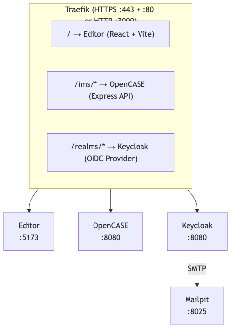

# Get Started with OpenCASE

Deploy the full OpenCASE stack with a single command.

## What you need

- A Linux server connected to the internet (Ubuntu 22.04+ recommended). A small instance on AWS, GCP, Azure, or any cloud provider is sufficient for most use cases.
- **Docker** and **Docker Compose** installed on the server
- **Git** installed on the server
- A **domain name** pointing to your server (e.g. `case.example.com`) — required for automatic HTTPS via Let's Encrypt
- Ports **80** and **443** open in your firewall

---

## Step 1 — Clone the repository

```bash
git clone git@github.com:1EdTech/OpenCASE.git
cd OpenCASE
```

---

## Step 2 — Configure

Copy the environment template and edit it:

```bash
cp docs/env.example .env
```

Set three values in `.env`:

| Variable | Purpose | Example |
|----------|---------|---------|
| `OPENCASE_HOSTNAME` | Your server's domain name | `case.example.com` |
| `ADMIN_PASSWORD` | Shared admin password for all services | a strong password |
| `ACME_EMAIL` | Email for Let's Encrypt certificate alerts | `you@example.com` |

The `.env` file defaults to HTTPS mode. All service URLs are constructed automatically from these variables — no other changes are needed.

> **Local / HTTP-only mode:** To run without TLS (e.g. on `localhost`), comment out the HTTPS block at the top of `.env` and uncomment the HTTP block. See the comments in the file for details.

---

## Step 3 — Start

```bash
docker compose up --build
```

The first run builds images, pulls dependencies, obtains a TLS certificate, and configures Keycloak automatically. This takes a few minutes. Subsequent starts are much faster.

> **Tip:** Add `-d` to run in the background, then `docker compose logs -f` to follow logs.

---

## Step 4 — Verify

Once the logs settle, open your browser:

| URL | What |
|-----|------|
| `https://YOUR_DOMAIN` | Editor UI |
| `https://YOUR_DOMAIN/health` | API health check (JSON) |
| `https://YOUR_DOMAIN/admin/` | Keycloak admin console |

---

## Step 5 — Log in

A system admin account is created on first startup:

| Field | Value |
|-------|-------|
| Email | `system-admin@local` |
| Password | The `ADMIN_PASSWORD` from `.env` |

Sign in at the Editor UI to start creating frameworks.

To access the Keycloak admin console, use username `admin` with the same `ADMIN_PASSWORD`.

---

## Managing the stack

```bash
docker compose down              # stop all services
docker compose down -v           # stop and remove all data
docker compose up --build        # restart / rebuild after changes
docker compose logs -f opencase  # follow logs for a specific service
```

---

## Architecture overview

All traffic enters through **Traefik**, which routes requests by URL path. In HTTPS mode, Traefik terminates TLS and redirects HTTP to HTTPS automatically.





---

## Data persistence

Framework data is stored on the host filesystem via a bind mount under `apps/opencase/data/`. Back it up by copying that directory.

Keycloak data (users, realm configuration) and TLS certificates are stored in Docker named volumes.

---

## Troubleshooting

**TLS certificate errors** — Verify your domain's DNS A record points to the server (`dig +short YOUR_DOMAIN`), ports 80 and 443 are open, and `ACME_EMAIL` is set in `.env`. Check `docker compose logs -f traefik` for details.

**Keycloak slow to start** — Normal on first boot while it initialises its database. Subsequent starts are faster.

**Connection refused** — Check that ports 80/443 are open in your firewall and all containers are running (`docker compose ps`).

**Authentication errors after changing hostname** — Verify `OPENCASE_HOSTNAME` in `.env` matches your domain, then restart with `docker compose down && docker compose up --build`.

---

## Next steps

- Change the default admin passwords
- Create a tenant via the Editor UI and start building frameworks
- Read the [Editor overview](../apps/editor/README.md) and [OpenCASE overview](../apps/opencase/README.md)
